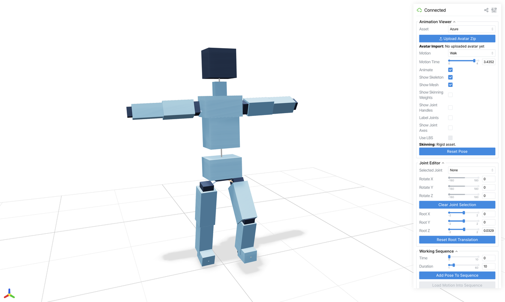

# Part 1: Kinematic Chains and Forward Kinematics

## Why This Part Matters

The first useful abstraction in character animation is not a mesh. It is a
tree of joints.

If we can describe a character as a root joint with children, and each joint
stores a local transform relative to its parent, then we can pose the whole
character by propagating transformations through the tree. That is forward
kinematics (FK).

This part uses a deliberately simple block character so that you can see the
hierarchy clearly and debug the motion without worrying about smooth mesh
deformation yet.

## Why The Project Starts With A Block Character

The early parts use a blocky articulated character rather than a realistic
human mesh.

That is deliberate. A block character makes the hierarchy easy to see:

- each body part is rigid
- each joint is easy to identify
- FK bugs are visually obvious

Once the skeleton logic is clear, we switch to SMPL and study mesh deformation.

## Learning Goals

By the end of Part 1, you should be able to:

- explain what a joint hierarchy or kinematic chain is
- distinguish local coordinates from world coordinates
- compute world-space joint rotations and positions from local transforms
- debug a broken articulated character by checking parent-child relationships
- create a short custom motion by placing key poses on a timeline

## Minimal Technical Background

### Coordinate Convention

In the viewer used for this project:

- `+z` is up
- `+y` is the character's forward direction

You do not need prior graphics experience, but you do need to be comfortable
with vectors, matrices, and matrix multiplication order.

### Skeleton Data

For each joint, the asset stores:

- a joint name
- a parent index
- a local translation from the parent joint to the child joint in the rest pose

For each pose, we also need:

- a local rotation for each joint
- a root translation offset for the whole character

### Forward Kinematics

Let joint `i` have parent `p(i)`.

For the root:

```text
R_world(root) = R_local(root)
p_world(root) = t_root + root_offset
```

For a non-root joint:

```text
R_world(i) = R_world(p(i)) R_local(i)
p_world(i) = p_world(p(i)) + R_world(p(i)) t_local(i)
```

This recurrence is the core implementation task for Part 1.

## Code Map

Start with these files:

- `viewer/asset_viewer.py`
- `viewer/student_submission/part1_fk.py`
- `viewer/motion_sequences.py`
- `assets/blocky/marigold.asset.json`
- `assets/blocky/azure.asset.json`

You do not need to understand the entire viewer. Focus on:

- how joint data is loaded
- where the parent array / hierarchy is stored
- where the viewer loads the FK implementation
- how a posed skeleton is turned into a visible character

## Part 1 Tasks

### Task 1: Run the Viewer and Inspect the Skeleton

Launch the viewer and spend time understanding the data before editing code.

Use the controls to inspect:

- the rigid mesh
- the skeleton overlay
- joint labels and joint handles
- the built-in walk and wave motions

The viewer should give you a direct view of the character, its joint hierarchy,
and the timeline controls you will use for testing.



You should be able to point to the shoulder, elbow, hip, knee, and root in the
viewer and identify their names in the code.

### Task 2: Implement Generic Forward Kinematics

Implement the FK routine in the student starter code.

Requirements:

- the implementation should work for any valid parent-child joint tree, not
  just one special case
- you should not rely on the joint list already being in parent-before-child
  order unless the starter code explicitly gives you a topological order
- the output must be one world rotation and one world position per joint

In plain language, this means:

- your code should work if we change the character but keep the same kind of
  skeleton data
- your code should work if joints appear in a different order in the file
- your code should use the parent relationship, not hardcoded assumptions such
  as "joint 3 is always processed after joint 2"

At minimum, your implementation should be correct for both provided block
characters.

### Task 3: Validate the Implementation

Use the viewer to test your FK implementation on the provided motions.

Check at least the following:

- rotating a shoulder moves the elbow and wrist
- rotating a hip moves the knee and ankle
- world-space joint positions follow the hierarchy correctly
- the rigid blocks stay attached to their assigned joints

You should actively look for failure cases such as:

- children moving without the parent
- joints rotating in place but not translating correctly
- mirrored or reversed motion caused by incorrect multiplication order

### Task 4: Author a Custom Motion

Create one short motion clip using the timeline tools in the viewer.

Requirements:

- at least `10` keyframes
- use the provided interpolation; you do not need to implement interpolation
  in this part
- the motion must involve at least one arm chain and one leg chain
- include a clear beginning, middle, and ending pose
- include either root translation or visible body-weight shift
- the result should be saved to the motion library and exported as a short video

Examples:

- step forward, crouch, jump, land, and recover balance
- wave to someone, turn the body, step sideways, and wave again
- prepare, kick, recoil, and transition into a different pose
- take two dance steps with coordinated arm motion and a final pose
- reach down, pick up an imaginary object, stand, and present it

Choose a motion phrase rather than a single isolated action. It should be
simple enough to debug, but non-trivial enough that bad FK would be obvious.

## What To Bring To Help Sessions

If you get stuck, bring a concrete debugging example:

- a screenshot with a broken pose
- the joint chain that is behaving incorrectly
- the part of the FK recurrence you are unsure about

That will make the help sessions much more productive than saying "the motion
looks wrong".

## Part 1 Output

By the end of this part you should have:

- a working FK implementation
- one saved custom motion clip with at least `10` keyframes
- one short exported video showing the result

This work feeds directly into Part 2, where the same motion will be reused on
SMPL.

There is no separate report submission at the end of Part 1.
Keep these files and figures ready for the interim submission:

- your code
- one custom motion clip from the viewer
- one short exported video
- one screenshot of the skeleton or joint hierarchy in the viewer
- one screenshot or frame from your custom motion

For the report requirements, see the interim report section in [Part 2](part2.md).
