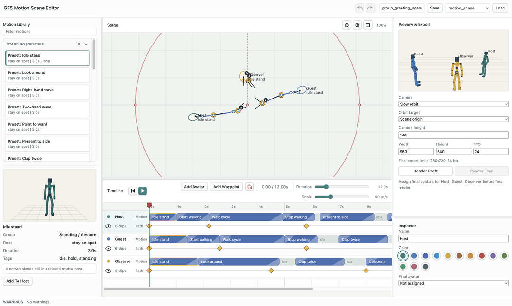
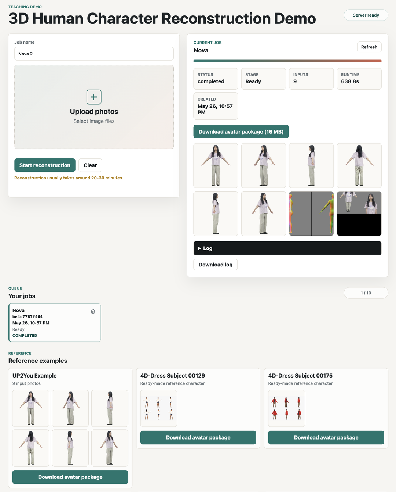
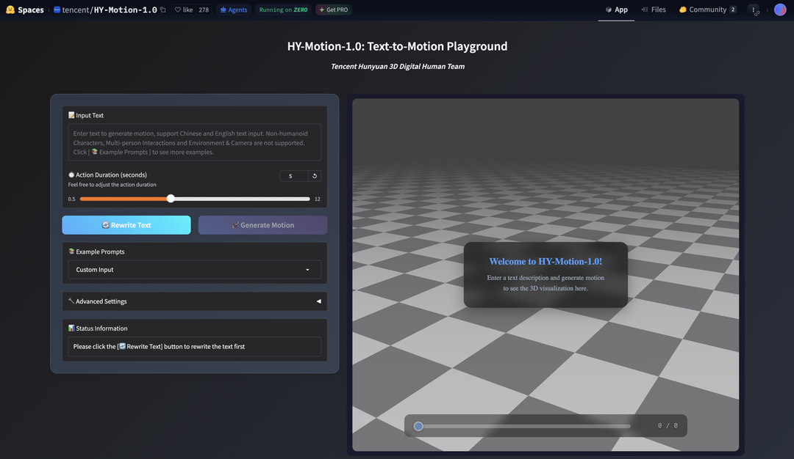

# Part 3: Group Character Animation Project

Part 3 is the final two-week group component of the project.

In Parts 1 and 2 you implemented the mechanics of character animation: forward
kinematics, skinning weights, one-hot attachment, and linear blend skinning.
Now you will use that pipeline to make a short animated scene with human
characters.

The goal is simple: make a coherent, good-looking animation that is at least 30
seconds long. Build a rough scene in the GF5 scene motion editor using the
provided motion library, then add custom avatars, generated motions, camera
changes, or other tools as needed.

## Learning Goals

By the end of Part 3, you should be able to:

- describe a character-animation pipeline that connects motion data, a
  skeleton, a skinned mesh, and a final render
- compose longer animation sequences from shorter motion clips by reasoning
  about timing, placement, facing direction, and transitions
- explain how a custom or reconstructed character can be driven by a shared
  animation skeleton
- compare alternative motion, avatar, and rendering choices using visual
  evidence
- identify common artifacts such as foot sliding, scale mismatch, skinning
  errors, retargeting errors, or appearance loss
- document a creative technical workflow clearly, including any external tools,
  generated assets, or AI tools used

## What To Build

Work in groups of two. Create a short animated scene featuring virtual human
characters.

The focus is not to build a full animation package. The focus is to connect the
ideas from Parts 1 and 2 to a more realistic character-animation workflow while
making sensible creative and technical choices.

## A Simple Way To Work

1. Build a rough scene with the provided motion library.
2. Preview it on the `SMPL-24 Proxy`, then adjust timing, `Path`, and facing.
3. Save the scene as a `.scene.json` file.
4. Try custom avatars, generated motions, or other tools as needed.
5. Render the final video and improve the result as much as you can.

## Tools Provided

The tools below are the main materials available for Part 3.

### Step 1: Explore The Scene Motion Editor

The GF5 scene motion editor contains the bundled Part 3 motion library.

From the repository root, launch the editor:

```bash
python viewer/scene_web_server.py --port 8093
```

The browser normally opens automatically. The local URL is
`http://localhost:8093`.

The scene editor lets you preview motion presets, arrange clips on character
tracks, edit the `Path` control and facing direction, and export drafts while
you shape the animation. For a fuller walkthrough of every panel, file
location, shortcut, and export option, see the
[Scene Editor Manual](scene_editor.md).

**Important:** `Path` controls the character root trajectory. This is separate from
the prescribed motion clip, which controls the local body pose over time. For
example, a walk cycle can be reused with different `Path` settings, and a
gesture can stay mostly in place while still using a chosen root position.



Use the `SMPL-24 Proxy` and the provided motion categories as your starting
point. The bundled presets are grouped by how they should be used. `Standing /
Gesture` clips are intended to stay on one spot, although the pelvis may still
bob or move vertically inside the pose. `Travel Loops` and `Travel Transitions`
are intended to follow the `Path` trajectory, `Turns` are intended to change
facing direction, and `Special Actions` are larger spot-action or
original-travel beats.

Use the editor to:

- add one or more characters to the scene
- place clips on a character timeline
- try combining different preset motions
- adjust timing, `Path`, and facing direction
- preview whether the action reads clearly on the `SMPL-24 Proxy`
- save the scene as a `.scene.json` file
- export a short draft video or screenshot for comparison

For useful preset motions, note:

- the motion name or source file
- what action the motion represents
- its approximate duration
- whether it works best on the spot, with a changing `Path`, or as a turn
- whether it contains contact-sensitive movement such as walking, jumping, or
  sitting
- any obvious artifacts when previewed on the proxy character

A good scene usually starts from a small number of readable actions. For example:
a character walks in, turns, waves, waits, and exits; two characters cross paths
and react; or a short group routine uses a loop, a gesture, and a final pose.

### Tool: Try A Custom 3D Avatar For Rendering

The character reconstruction workflow creates a custom virtual character for
rendering using [UP2You](https://github.com/zcai0612/UP2You).



Downloaded avatar packages go in `libraries/avatars/`. Extract each ZIP into its
own named folder. The scene editor lists built-in blocky characters, local SMPL
models when installed, and extracted avatar packages in the `Final avatar`
dropdown after a page refresh. The ZIP file by itself is only an archive; the
editor needs the extracted layout. The OBJ stores the visible character mesh,
and the NPZ stores how that mesh follows the SMPL-24 course body skeleton during
animation. For example:

```text
libraries/avatars/alex/outputs/animation_lowres.obj
libraries/avatars/alex/outputs/animation_lowres_skinning_weights.npz
libraries/avatars/alex/outputs/smplx_mesh.obj
```

Useful checks for custom avatars:

- inspect the mesh from several camera angles
- check scale, orientation, and appearance
- compare the avatar render against the `SMPL-24 Proxy` preview
- note artifacts such as foot sliding, skinning collapse, clothing deformation,
  or color loss

{{video: assets/final_avatar_scene.mp4 | Example final render using a custom avatar. | autoplay | loop}}

### Tool: Generate Custom Motion With HY-Motion-1.0

[HY-Motion-1.0](https://github.com/Tencent-Hunyuan/HY-Motion-1.0) can generate
short candidate motions from text prompts:
[HY-Motion-1.0 demo](https://huggingface.co/spaces/tencent/HY-Motion-1.0).



Good prompts describe one physical action:

- `A person turns left and waves.`
- `A person walks forward and stops.`
- `A person points forward with the right hand.`
- `A person performs a short dance step.`
- `A person stands still and raises both arms.`

For more prompt ideas, look at the examples provided on the HY-Motion-1.0 demo
page.

After downloading a HY-Motion result, keep the `.fbx` animation file and the
matching `.txt` prompt file together. They must have the same base filename, for
example:

```text
wave_to_camera.fbx
wave_to_camera.txt
```

In the GF5 scene editor, click `Import HY-Motion` in the Motion Library panel
and select both files. The editor converts the pair into a custom GF5 motion
clip under `libraries/motions/custom/`, refreshes the library, and lists the
result as a `Custom:` motion.

## Improve Rendering Quality

Try to make the final animation look better. Use whatever tools are useful,
including external renderers, AI tools, custom assets, or your own workflow.

Possible starting questions:

- Should we adjust the camera trajectory or framing?
- Is it possible to add a background scene or simple environment?
- How can the motion or avatar look more realistic?

What about lighting, shadows, ground contact, texture quality, foot sliding,
motion timing, multi-character staging, or a better export path? Brainstorm
ideas and try out different online or local tools.

## Final Report

See instructions on the [Final Report](final_report.md) page.

## Skeleton Note

GF5 uses SMPL-24 as the shared 24-joint body skeleton for Part 3. This is the
same body-skeleton idea used in Parts 1 and 2, now applied to human motion
clips: the proxy character, motion presets, skinning weights, and custom avatars
all need to agree on the same SMPL-24 joint layout.

Some reconstruction tools, including UP2You, use SMPL-X internally while fitting
the avatar. SMPL-X is more detailed than SMPL-24: for example, it includes face,
jaw, eye, and detailed hand/finger joints, while the Part 3 SMPL-24 skeleton
keeps one coarse `left_hand` and `right_hand` joint. The exported GF5 avatar
package maps the reconstructed mesh back to the SMPL-24 skeleton, so it can
follow the same motions as the `SMPL-24 Proxy`.

## What To Bring To Help Sessions

Bring enough context that we can see what you are trying to do.

- show the editor, a screenshot, or a short clip
- point to the part that feels wrong or unfinished
- bring one concrete question, idea, or experiment you want to try

That is enough; the session can stay practical and conversational.
